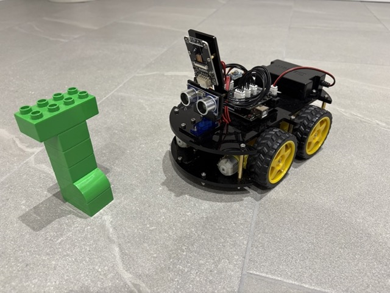

# Robo Turtle

This repo contains Python code that can control an [Elegoo Smart Car V4](https://www.elegoo.com/en-gb/blogs/arduino-projects/elegoo-smart-robot-car-kit-v4-0-tutorial) using commands similar to
[Python Turtle](https://docs.python.org/3/library/turtle.html).



## Getting Started

Connect your computer wifi network exposed by the robot.

Run:
```
python main.py
```
The robot will drive around looking for green duplo.


## car.py

The `Car` class communicates with the robot and exposes methods similar to a turtle for simple programming.

In particular `Car` handles heartbeating with the robot to prevent it disconnecting.

* `start()` - Connects to the comms socket and starts the heartbeating thread
* `close()` - Disconnects and shuts down heartbeating
* `stop()` - Stops all motors
* `forward(distance = None)` - move forward until `stop()` is called.
* `forward(distance = 1)` - move forward 1 distance unit.
* `backward(distance = None)` - move backward until `stop()` is called.
* `backward(distance = 1)` - move backward 1 distance unit.
* `left(angle = 45)` - Turn left approximately `angle` amount.
* `right(angle = 45)` - Turn right approximately `angle` amount.
* `rotate_camera_left()` - Rotate camera and distance sensor component 90 degress left.
* `rotate_camera_right()` - Rotate camera and distance sensor component 90 degress right.
* `rotate_camera_forward()` - Rotate camera and distance sensor component straight ahead.
* `measure_dist()` - Returns distance measured by distance sensor.
* `check_off_ground()` - Returns True if the car detects it has been lifted off the ground.
* `capture_image()` - Captures the current image as a NumPy array.
* `find_coloured_shape(lower, upper)` - Finds the biggest shape the camera can see within the `lower` and `upper` colour bounds. Returns `cX`- centre of shape or -1 if not found; `cY` - centre of shape or -1 if not found, `area` or shape, `image` - capture image with shape drawn on.


## Notes

* The car cannot measure distances or angles so moving or turning by an anmount are done based on time,
as such they are approximate and are affected by battery level, grip on suface etc.
* run `python hsvThresholder.py` to experiment with `lower` and `upper` HSV values for object detection.

## Credits

Thanks for inspiration from the following:

* bots4All (https://youtu.be/j7p44vxyvdM?si=GYsIcvUHtFzWH5As)
* https://github.com/bots4a11/ElegooRobotCarV4
* https://github.com/saurabheights/IPExperimentTools/blob/master/AnalyzeHSV/hsvThresholder.py
